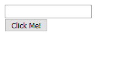
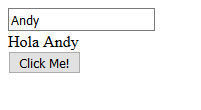

## Tutorial 1. Conceptos básicos. ##

En el presente tutorial vamos a desarrollar una aplicación muy simple compuesta por una caja de texto, una etiqueta y un botón. La lógica de la misma consiste en que al hacer clic en el botón, se muestre en la etiqueta un saludo con el texto introducido en la caja de texto.

#### 1. Creando un directorio de trabajo. ####

	$ mkdir tutorial1
	$ cd tutorial1

#### 2. Instalando GluePHP. ####

Cree un archivo de nombre *composer.json* con el siguiente contenido:

	{
	    "require": {
	        "andaniel05/composed-views": "dev-0.1a",
	        "andaniel05/glue-php": "dev-0.1a"
	    },
	    "autoload": {
	        "psr-4": {
	            "GluePHPDemo\\Tutorial1\\": "src/"
	        }
	    }
	}

Ahora ejecute la instalación con Composer:

	$ composer update

#### 3. Creando la clase de la aplicación. ####

Cree el archivo *src/App.php* con el siguiente contenido:

	<?php
	
	namespace GluePHPDemo\Tutorial1;
	
	use Andaniel05\GluePHP\AbstractApp;
	
	class App extends AbstractApp
	{
	    public function html(): ?string
	    {
	        return <<<HTML
	<!DOCTYPE html>
	<html lang="en">
	<head>
	    <meta charset="utf-8">
	    <title>Tutorial1 de GluePHP</title>
	</head>
	<body>
	    {$this->renderSidebar('body')}
	
	    {$this->renderAssets('scripts')}
	</body>
	</html>
	HTML;
	    }
	}

El método App::html() devuelve un valor tipo string que se corresponde con el código HTML o vista de la página. En el mismo, se puede observar la existencia de la línea `{$this->renderSidebar('body')}`. El significado de la misma consiste en que en esa posición será mostrado el contenido del sidebar de nombre 'body'. Un sidebar es una región dentro del código HTML donde se insertan los componentes de forma dinámica y en la clase AbstractApp existe registrado por defecto un único sidebar cuyo nombre es precisamente 'body'.

Es importante mencionar también el significado de la línea `{$this->renderAssets('scripts')}`. La misma indica que en esa posición se deben mostrar todos los assets de tipo scripts de los que depende la aplicación. Más adelante se profundizará en el trabajo con assets.

#### 4. Creando la clase del componente caja de texto. ####

Cree el archivo *src/Component/Input.php* con el siguiente contenido:

	<?php
	
	namespace GluePHPDemo\Tutorial1\Component;
	
	use Andaniel05\GluePHP\Component\AbstractComponent;
	
	class Input extends AbstractComponent
	{
	    /**
	     * @Glue
	     */
	    protected $text;
	
	    public function html(): ?string
	    {
	        return '<input type="text" gphp-bind-value="text">';
	    }
	}

Como se puede observar, la clase cuenta con un atributo llamado 'text' que presenta la anotación `@Glue`. Esto constituye uno de los conceptos más importantes y útiles de GluePHP. Cuando se ejecuta una app en el navegador, en este se construye un objeto JavaScript que se corresponde con cada objeto componente presente en la app. Los atributos que estén marcados con esta anotación estarán presentes en el componente JavaScript donde presentarán un *Double Binding* con el respectivo objeto componente del servidor. Estos atributos son llamados **glue attributes**. Cuando el valor de dicho atributo cambie en el navegador, será registrada en este una actualización remota para dicho atributo. Una vez ocurra un evento a ser procesado en el servidor, con la respectiva solicitud ajax serán llevadas todas las actualizaciones registradas al servidor donde serán ejecutadas. Si después de procesar el evento en el servidor, ha cambiado algún atributo `@Glue` de algún componente, estas actualizaciones son enviadas al navegador en la respuesta de la solicitud ajax en proceso.

Otro aspecto a destacar en la clase radica en la existencia del atributo HTML `gphp-bind-value="text"` presente en la vista del componente. Dicho atributo le dice al navegador que cree un *Double Binding* entre este elemento HTML y el *glue attribute* text del componente JavaScript. Tenga en cuenta que el valor del atributo `gphp-bind-value` tiene que hacer referencia a un *glue attribute* existente. En este caso, cuando el valor del elemento input del componente cambie, la app registrará una actualización remota para ese *glue attribute* y de manera equivalente, cuando cambie el valor de ese *glue attribute* lo hará también el valor de dicho elemento input.

Es importante mencionar que la vista de un componente puede ser cualquier fragmento de código HTML y no solamente un único elemento.

#### 5. Creando la clase del componente etiqueta. ####

Cree el archivo *src/Component/Label.php* con el siguiente contenido:

	<?php
	
	namespace GluePHPDemo\Tutorial1\Component;
	
	use Andaniel05\GluePHP\Component\AbstractComponent;
	
	class Label extends AbstractComponent
	{
	    /**
	     * @Glue
	     */
	    protected $text;
	
	    public function html(): ?string
	    {
	        return '<label gphp-bind-html="text"></label>';
	    }
	}

La clase Label es muy similar a la clase Input. Ambas solo difieren en la vista y en el caso de esta clase se ha usado el atributo `gphp-bind-html` para realizar el *Double Binding* entre el *glue attribute* y el contenido HTML del elemento label. Esto es debido a las características HTML de la etiqueta label.

#### 6. Creando la clase del componente botón. ####

Cree el archivo *src/Component/Button.php* con el siguiente contenido:

	<?php
	
	namespace GluePHPDemo\Tutorial1\Component;
	
	use Andaniel05\GluePHP\Component\AbstractComponent;
	
	class Button extends AbstractComponent
	{
	    /**
	     * @Glue
	     */
	    protected $text = 'Click Me!';
	
	    public function html(): ?string
	    {
	        return '<button gphp-bind-html="text" gphp-bind-events="click"></button>';
	    }
	}

En este caso la vista se corresponde con un elemento 'button'. Como en el caso anterior, el texto del botón será el valor del atributo 'text' con la pequeña diferencia que este trae un valor por defecto.

El principal aspecto a resaltar está en la presencia del atributo HTML `gphp-bind-events="click"`. Esto le dice a GluePHP que el evento 'click' de este elemento representa el evento 'click' del respectivo *glue component*. En otras palabras, al hacer clic en este botón será disparado en el servidor un evento de nombre '{component_id}.click', donde '{component_id}' representa el identificador del componente. El id de los componentes se les establece con el primer argumento del constructor y si este es omitido se creará uno por defecto. 

#### 7. Creando el controlador de carga. ####

Cree el archivo *public/index.php* con el siguiente contenido:

	<?php
	
	require_once '../bootstrap.php';
	
	use GluePHPDemo\Tutorial1\App;
	use GluePHPDemo\Tutorial1\Component\{Input, Label, Button};
	
	// Se instancia la app. Es obligatorio indicarle la ruta al controlador
	// de eventos. En este caso es 'process.php';
	$app = new App('process.php');
	
	// Se instancian los componentes.
	$input1 = new Input('input1');
	$label1 = new Label('label1');
	$button1 = new Button('button1');
	
	// Los componentes se añaden al sidebar 'body'.
	$app->appendComponent('body', $input1);
	$app->appendComponent('body', $label1);
	$app->appendComponent('body', $button1);
	
	// Se indica que la función 'onButton1Click' procesará el evento
	// 'click' del componente 'button1'.
	$button1->on('click', 'onButton1Click');
	
	// Se persiste la app. En este caso la persistencia se hace a través
	// de la sesión.
	//
	
	$app->setBooted(true); // Obligatorio.
	
	session_start();
	$_SESSION['app'] = $app;
	
	// Se imprime en el navegador el código HTML de la página.
	$app->print();

Los comentarios del archivo indican su funcionamiento.

Cree el archivo *bootstrap.php* con el siguiente contenido:

	<?php
	
	require_once 'vendor/autoload.php';
	
	function onButton1Click($event)
	{
	    $label1 = $event->app->label1;
	    $input1 = $event->app->input1;
	
	    $label1->setText('Hola ' . $input1->getText());
	}

Como puede verse en el archivo *bootstrap.php* hemos definido la función *onButton1Click* la cuál fué definida en el controlador de carga como la encargada de procesar el evento clic del botón. Toda función manejadora de eventos recibe un argumento con información del mismo. Dicho argumento es una instancia de la clase `Andaniel05\GluePHP\Event\Event` la cual cuenta con un atributo 'app' que no es más que la aplicación donde ha ocurrido el evento. A través de este atributo se pueden obtener los componentes tal y como se muestra.

Todos los *glue components* presentan métodos dinámicos tipo *getter* y *setter* los cuales permiten obtener y establecer los valores de los *glue attributes*.

#### 8. Creando el controlador de eventos. ####

Cree el archivo *public/process.php* con el siguiente contenido:

	<?php
	
	require_once '../bootstrap.php';
	
	use Andaniel05\GluePHP\Request\Request;
	
	// Obtiene la instancia de la aplicación persistida por el
	// controlador de carga.
	//
	
	session_start();
	$app = $_SESSION['app'];
	
	// La instancia de la aplicación procesa la solicitud.
	$request = Request::createFromJSON($_REQUEST['glue_request']);
	$response = $app->handle($request);
	
	// Vuelve a persistir la aplicación.
	$_SESSION['app'] = $app;
	
	// Envía al navegador la respuesta en formato JSON.
	echo $response->toJSON();
	die();

Los comentarios del código fuente explican el funcionamiento del mismo.

#### 9. Ejecutando la aplicación. ####

Para probar la aplicación usaremos el servidor web que viene integrado por defecto en el intérprete de PHP.

Ejecute los siguientes comandos:

	$ cd public
	$ php -S localhost:8080

Puede cambiar el puerto especificado en caso necesario.

Una vez que el servidor web esté en ejecución abrimos el navegador y accedemos a la url donde hemos ejecutado el proyecto(http://localhost:8080/). La página se muestra de la siguiente forma:

Podemos comprobar el funcionamiento de la aplicación introduciendo un nombre en el campo de texto y presionando el botón.

